# Лабораторная 1

## С помощью Докер-контейнера настроили шардинг

### Config servers
```
version: '3'

services:

  cfgsvr1:
    container_name: cfgsvr1
    image: mongo
    command: mongod --configsvr --replSet cfgrs --port 27017 --dbpath /data/db
    ports:
      - 14001:27017
    volumes:
      - cfgsvr1:/data/db
    networks:
      - mongo

  cfgsvr2:
    container_name: cfgsvr2
    image: mongo
    command: mongod --configsvr --replSet cfgrs --port 27017 --dbpath /data/db
    volumes:
      - cfgsvr2:/data/db
    networks:
      - mongo

  cfgsvr3:
    container_name: cfgsvr3
    image: mongo
    command: mongod --configsvr --replSet cfgrs --port 27017 --dbpath /data/db
    volumes:
      - cfgsvr3:/data/db
    networks:
      - mongo

volumes:
  cfgsvr1: {}
  cfgsvr2: {}
  cfgsvr3: {}

networks:
  mongo:
    name: mongo
    external: true
```

Initiate replica set
mongo mongodb://127.0.0.1:14001
```
rs.initiate(
  {
    _id: "cfgrs",
    configsvr: true,
    members: [
      { _id : 0, host : "cfgsvr1:27017" },
      { _id : 1, host : "cfgsvr2:27017" },
      { _id : 2, host : "cfgsvr3:27017" }
    ]
  }
)

rs.status()
```
### Mongos Router

version: '3'
```
services:

  mongos:
    container_name: mongos
    image: mongo
    command: mongos --configdb cfgrs/cfgsvr1:27017,cfgsvr2:27017,cfgsvr3:27017 --bind_ip 0.0.0.0 --port 27017
    ports:
      - 60000:27017
    networks:
      - mongo

networks:
  mongo:
    name: mongo
    external: true
```

### Shard 1 servers
```
version: '3'

services:

  shard1svr1:
    container_name: shard1svr1
    image: mongo
    command: mongod --shardsvr --replSet shard1rs --port 27017 --dbpath /data/db
    ports:
      - 24001:27017
    volumes:
      - shard1svr1:/data/db
    networks:
      - mongo

  shard1svr2:
    container_name: shard1svr2
    image: mongo
    command: mongod --shardsvr --replSet shard1rs --port 27017 --dbpath /data/db
    volumes:
      - shard1svr2:/data/db
    networks:
      - mongo

  shard1svr3:
    container_name: shard1svr3
    image: mongo
    command: mongod --shardsvr --replSet shard1rs --port 27017 --dbpath /data/db
    volumes:
      - shard1svr3:/data/db
    networks:
      - mongo

volumes:
  shard1svr1: {}
  shard1svr2: {}
  shard1svr3: {}

networks:
  mongo:
    name: mongo
    external: true
```


Initiate replica set
```
mongo mongodb://127.0.0.1:24001

rs.initiate(
  {
    _id: "shard1rs",
    members: [
      { _id : 0, host : "shard1svr1:27017" },
      { _id : 1, host : "shard1svr2:27017" },
      { _id : 2, host : "shard1svr3:27017" }
    ]
  }
)

rs.status()
```

### Shard 2 servers
```
version: '3'

services:

  shard2svr1:
    container_name: shard2svr1
    image: mongo
    command: mongod --shardsvr --replSet shard2rs --port 27017 --dbpath /data/db
    ports:
      - 24004:27017
    volumes:
      - shard2svr1:/data/db
    networks:
      - mongo

  shard2svr2:
    container_name: shard2svr2
    image: mongo
    command: mongod --shardsvr --replSet shard2rs --port 27017 --dbpath /data/db
    volumes:
      - shard2svr2:/data/db
    networks:
      - mongo

  shard2svr3:
    container_name: shard2svr3
    image: mongo
    command: mongod --shardsvr --replSet shard2rs --port 27017 --dbpath /data/db
    volumes:
      - shard2svr3:/data/db
    networks:
      - mongo

volumes:
  shard2svr1: {}
  shard2svr2: {}
  shard2svr3: {}

networks:
  mongo:
    name: mongo
    external: true
```
Initiate replica set
```
mongo mongodb://127.0.0.1:24004
rs.initiate(
  {
    _id: "shard2rs",
    members: [
      { _id : 0, host : "shard2svr1:27017" },
      { _id : 1, host : "shard2svr2:27017" },
      { _id : 2, host : "shard2svr3:27017" }
    ]
  }
)

rs.status()
```
### Add shard to the cluster
Connect to mongos
```
mongo mongodb://127.0.0.1:60000
```
Add shard
```
mongos> sh.addShard("shard2rs/shard2svr1:27017,shard2svr2:27017,shard2svr3:27017")
mongos> sh.status()
```


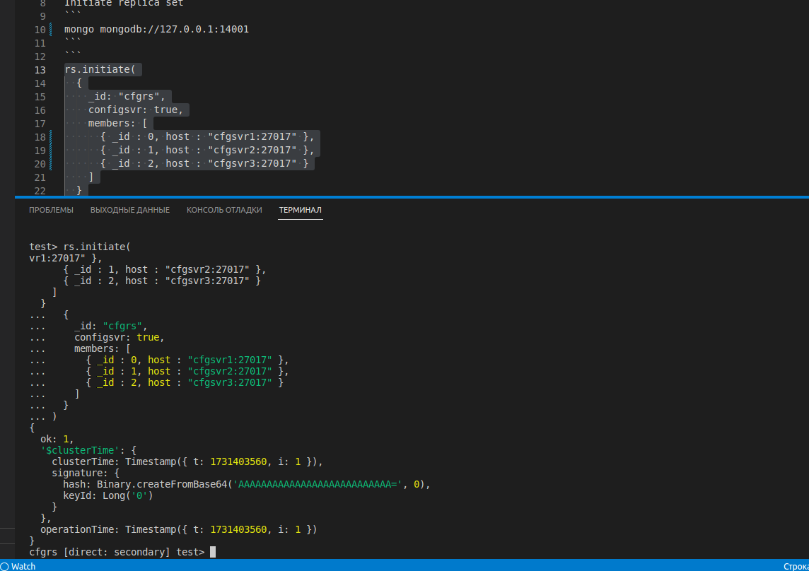
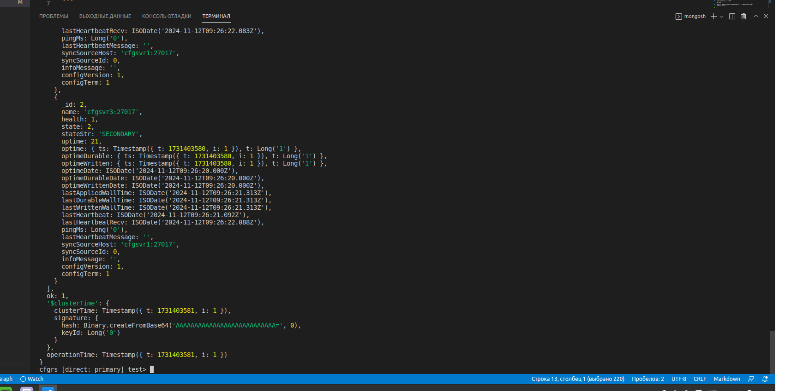
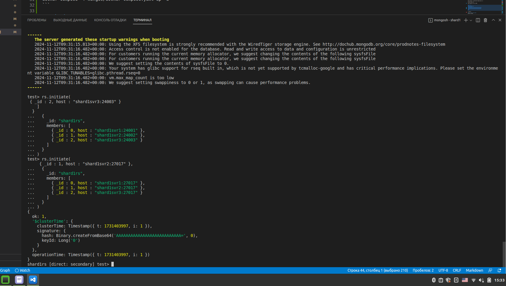
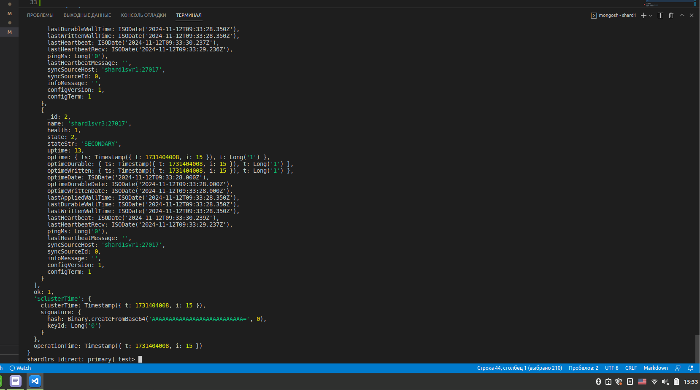
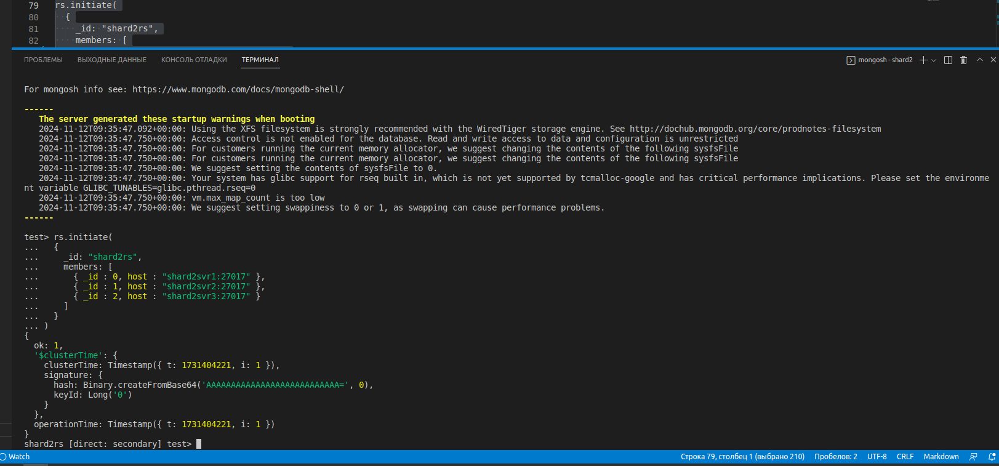
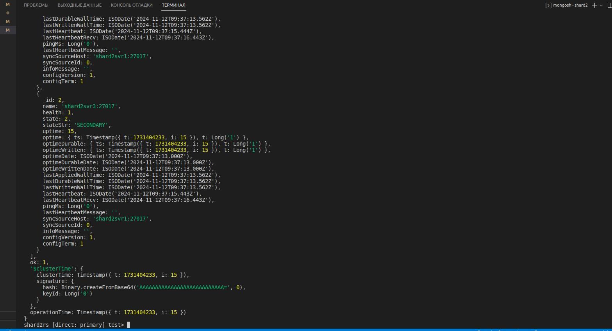
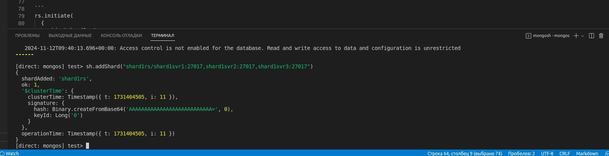

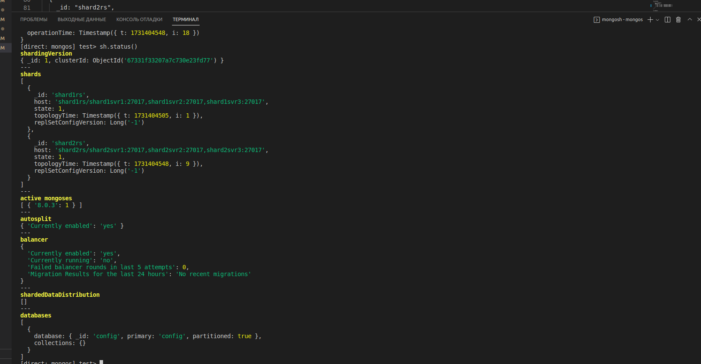
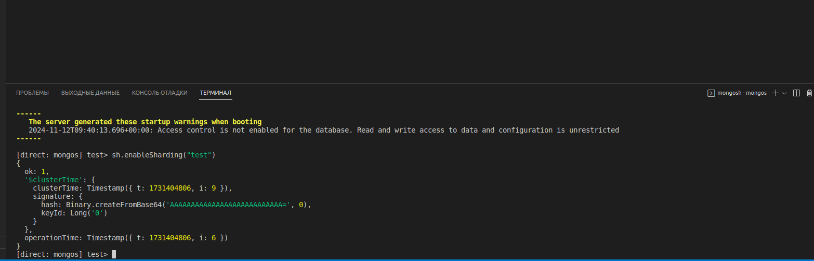
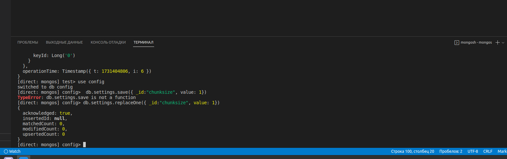
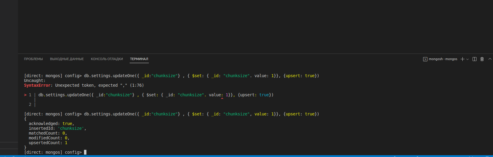
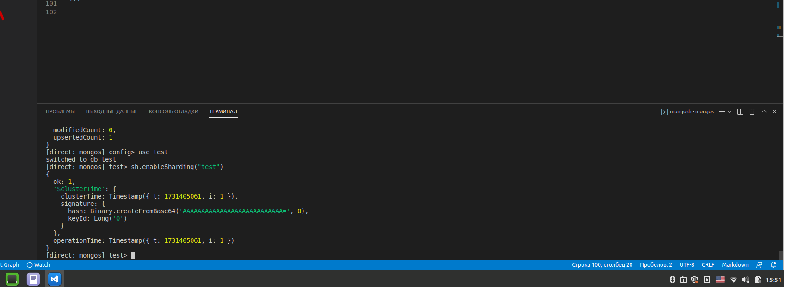
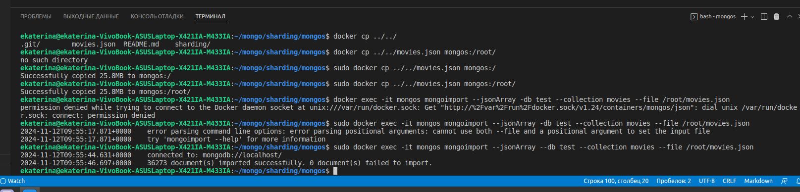
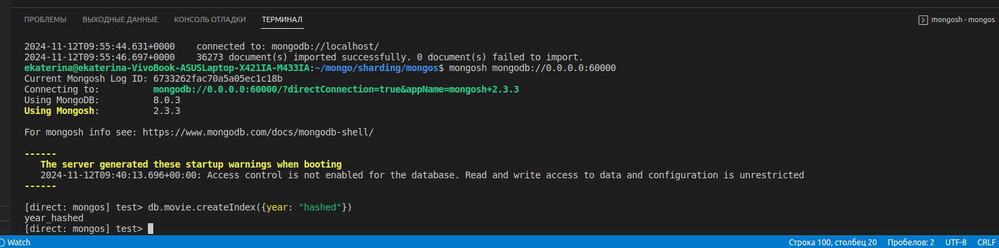
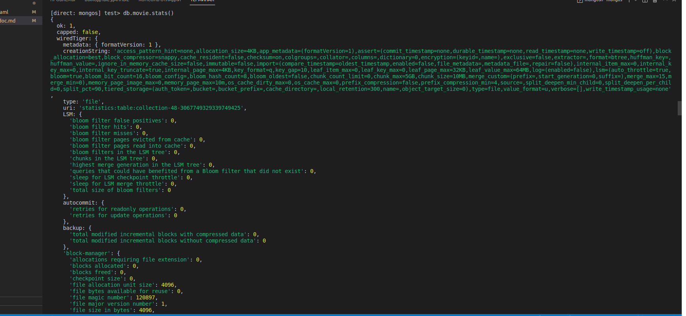
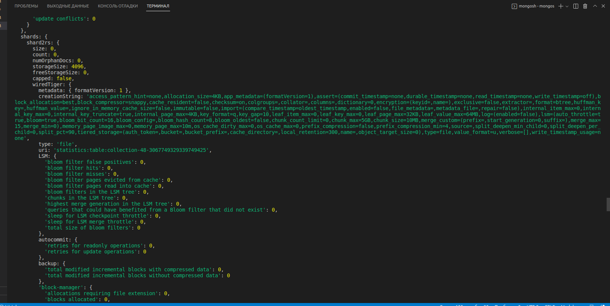

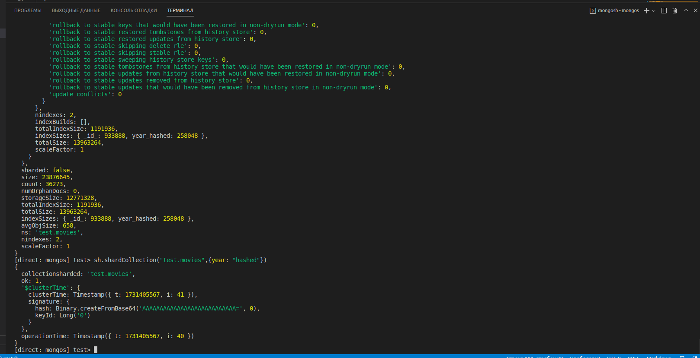
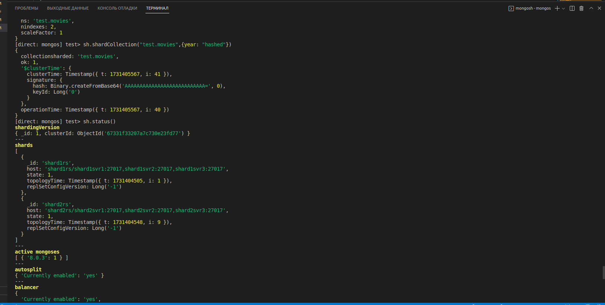
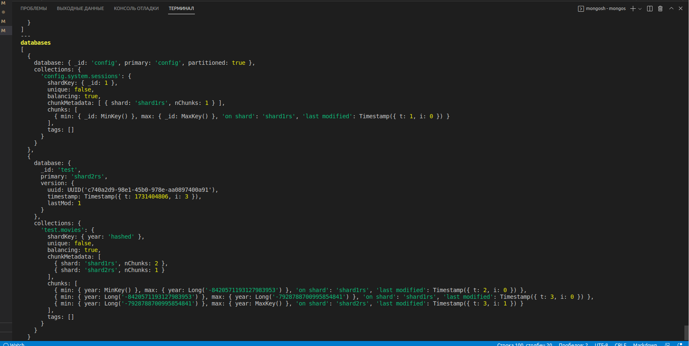
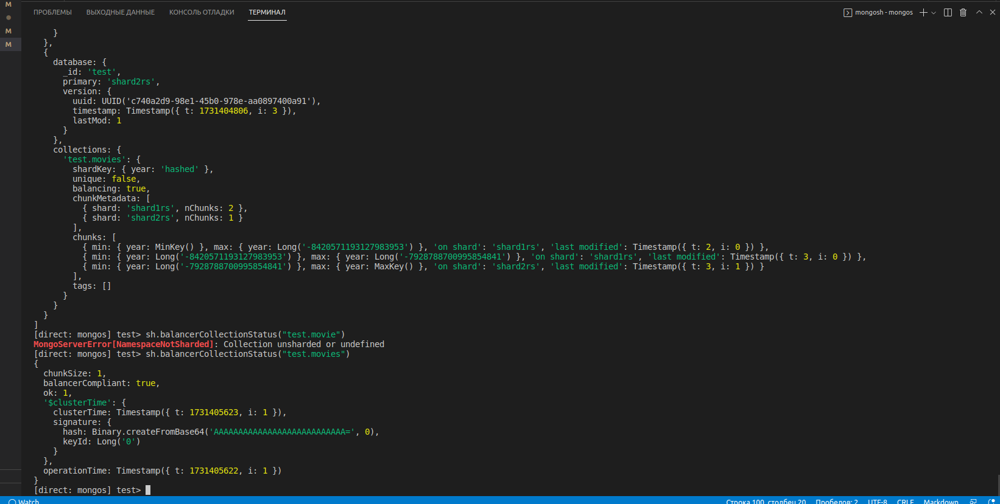
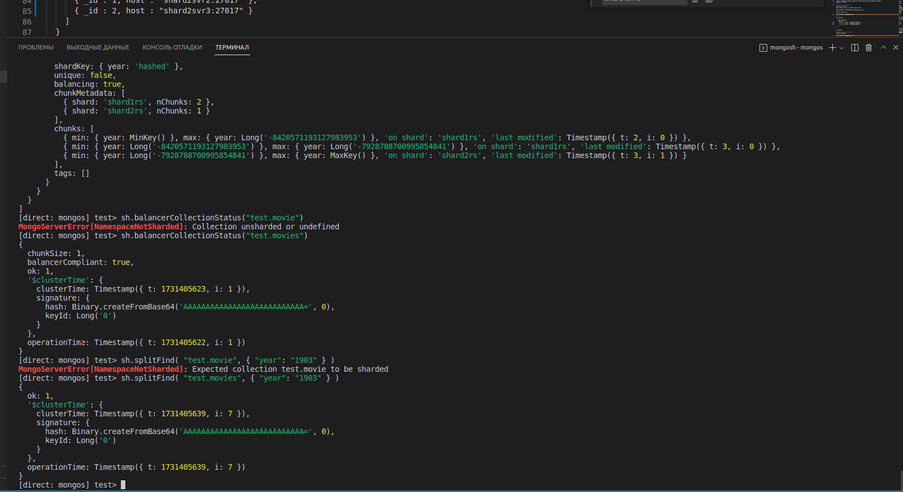

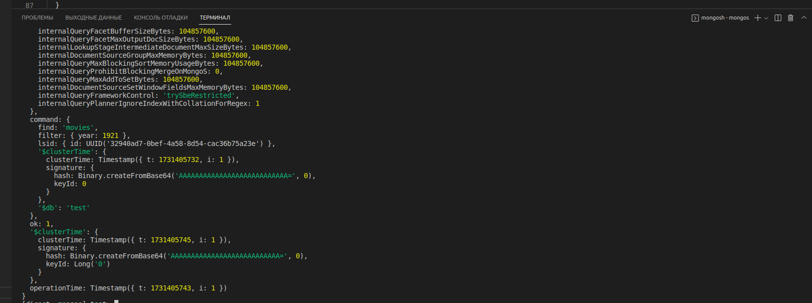


